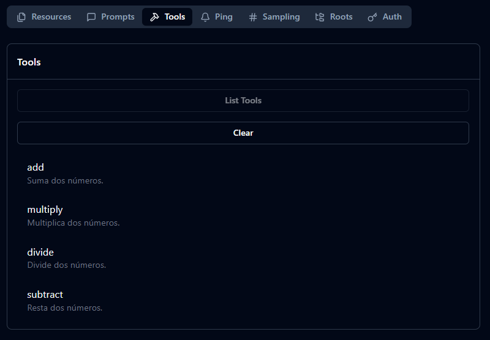
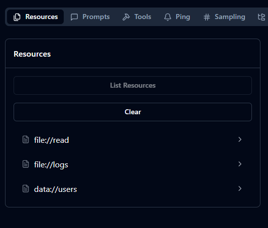
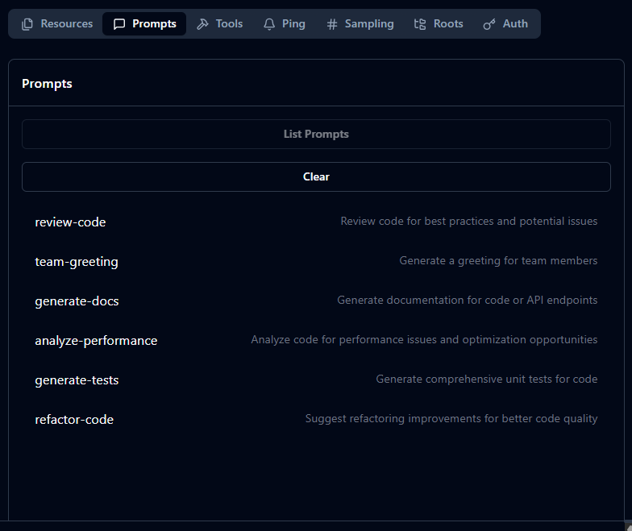
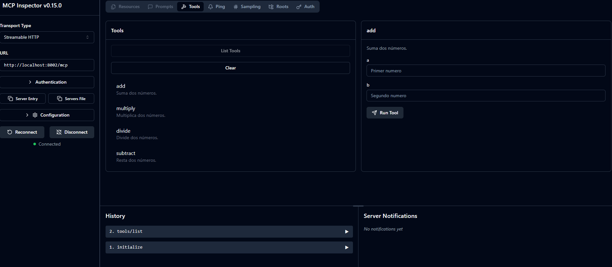

# MCP Server (NodeJS and NestJS version)
NodeJS integrated MCP Server version. 

## Integrations:
- Tools
- Resources
- Prompts

## Tools: 
When starting the server you will see 4 example tools.



Check the `tools-example.service.ts` file to understand how it works.

## Resources: 
When starting the server you will see 3 available resources to test.
It provides example files to allow interaction with them.



Check the `resources-example.service.ts` file to understand how it works.

## Prompts: 
When starting the server you will see 6 types of available prompts to interact with. Each one has a specific characteristic to exemplify different use cases.



Check the `prompts-example.service.ts` file to understand how it works.

## Environment variables:
To start MCPs locally make sure to add these variables:

```bash
# Port for NestJS HTTP API
PORT=8002

# MCP Transport: 'stdio' or 'http'
MCP_TRANSPORT=http

# Logging level
LOG_LEVEL=debug
```

### Starting the server

#### Docker:
If you use docker you can run the command `docker build -t mcp-node .` and then the following command:
```bash
docker run --name mcp-node-container -p 8002:8002 \
  -e MCP_TRANSPORT=http \
  -e LOG_LEVEL=debug \
  mcp-node
```

#### Using NestJS:
Run `npm run start:dev` to view logs and make changes dynamic.

Another option is to run `npm run build` and then `npm run start:prod` to run the compiled product.

### Test your MCP

**Run the command `npx @modelcontextprotocol/inspector` to visualize something like this:**



